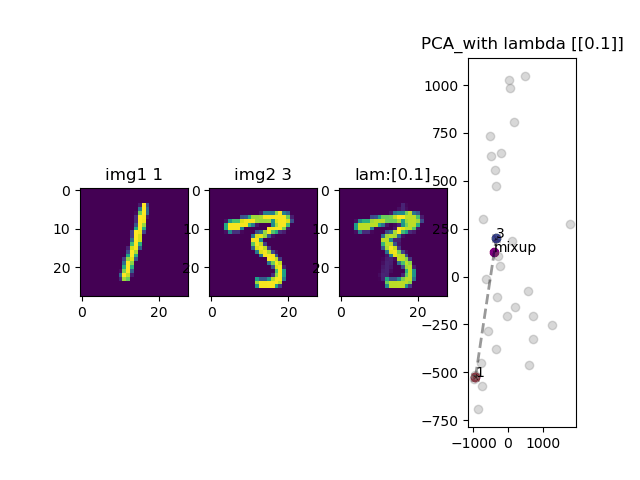
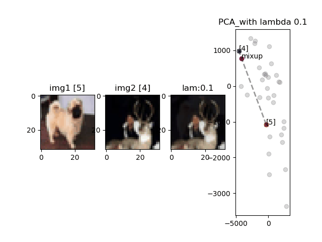

# mixup_keras
implementation of mixup paper ICLR 2018 with tensorflow 1.13.1

## Introduction
In this work, Facebook research propose mixup, a simple learning principle to alleviate these issues. In essence, mixup trains
a neural network on **convex combinations** of pairs of examples and their labels.
By doing so, mixup regularizes the neural network to favor simple linear behavior
in-between training examples.

## Dependency

Please check the requirements.txt.
```
pip install -r requirements.txt
```

## Usage

Train

```python
python train.py
```

Visualize the result of convex combinations.

```python
python visualize.py
```

## Visualization: convex combination

- MNIST



- CIFAR10



- FashionMNIST


## Reference

- [paper][mixup: BEYOND EMPIRICAL RISK MINIMIZATION](https://arxiv.org/abs/1710.09412)
- [github](https://github.com/facebookresearch/mixup-cifar10)
